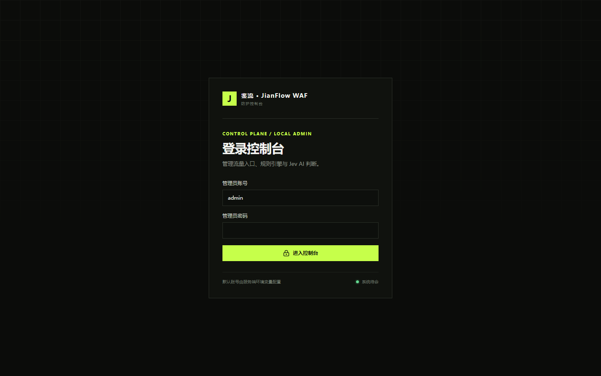

# 鉴流 · JianFlow WAF

给想在自己的服务前试用 WAF 的开发者：用本地规则、Jev 模型，或者两者一起检查 HTTP 请求。

[](LICENSE)
[](https://github.com/wrhc2010/JianFlow-WAF/releases)
[](https://github.com/wrhc2010/JianFlow-WAF/actions/workflows/ci.yml)
[](package.json)

**中文** | [English](README.en.md)

> 这是用于演示和实验的原型，未经过安全审计、压测或生产验证。不要把它当成已经可以保护生产站点的 WAF。

## 看一眼



本地运行的控制台登录页。登录后可查看请求事件、切换防护模式、测试规则和修改上游地址。

## 快速开始

需要 Docker Compose v2；也可以用 Node.js 22 本地启动。先准备一个自己的测试上游服务，别直接接生产流量。

### Docker Compose（拉取镜像）

```bash
git clone https://github.com/wrhc2010/JianFlow-WAF.git
cd JianFlow-WAF
cp .env.example .env
```

编辑 `.env`：填写 `ADMIN_PASSWORD`、`SESSION_SECRET` 和 `POSTGRES_PASSWORD`（PostgreSQL 密码请用不含 URL 特殊字符的随机字符串）；把 `UPSTREAM_URL` 改成测试服务地址。需要 AI 判断时再填写 `OPENROUTER_API_KEY`，不需要则在控制台选择“传统规则”模式。

```bash
docker compose up -d --pull always --no-build
```

此命令拉取 GHCR 的 API 和 Web 镜像。想从源码构建，把最后一行换成 `docker compose up -d --build`。默认管理后台在 `http://localhost:3000`，WAF HTTP 入口在 `http://localhost:8080`，健康检查在 `http://localhost:4000/api/v1/health`。Compose 的管理后台和 WAF 端口默认监听局域网，API 仅绑定本机，数据库不对主机开放；在不可信网络中请先通过可信的 HTTPS 反向代理保护管理后台，并限制访问来源。

Compose 默认上游是 `http://host.docker.internal:9000`，用于连接宿主机上的测试服务。如果上游也在同一 Compose 网络，改用服务名，例如 `UPSTREAM_URL=http://app:8080`。上游地址填错时，放行的请求会得到 502。

### 本地开发

```bash
npm ci
cp .env.example .env
# 在 .env 中至少设置 ADMIN_PASSWORD；本地不需要数据库时保持 DATABASE_URL 为空
npm run dev
```

控制台：`http://127.0.0.1:3000`；API：`http://127.0.0.1:4000`；WAF：`http://127.0.0.1:8080`。`npm run dev` 会先编译 core 包。默认账号名是 `admin`，密码取自你设置的 `ADMIN_PASSWORD`。

### 最小请求

保持默认“混合模式”，用下面的请求确认内置 SQL 注入规则会在上游之前拦截：

```bash
curl -i "http://127.0.0.1:8080/search?q=union+select+password+from+users"
```

预期返回 `403`。这是规则测试，不会调用模型，也不要求上游在线。普通请求要成功转发，则需要先把 `UPSTREAM_URL` 指向一个能访问的测试服务。

## 功能与配置

- **AI 判断**：Jev 返回 `noul` 恶意概率，达到阈值就拦截。Jev 不可用时返回 503。
- **传统规则**：当前只有五条内置的 CRS 风格示例规则，覆盖部分 SQL 注入、XSS、路径穿越、命令注入和扫描路径；并非完整 OWASP CRS，也不能替代正式规则集。
- **混合模式**：先检查本地规则，未被规则拦截的请求交给 Jev。Jev 不可用时会按规则结果放行，并记录降级事件。
- **事件与设置**：查看最近请求、切换模式与阈值、测试规则、设置默认上游。支持 HTTP 和 WebSocket 握手检查；WebSocket 建立后的消息直接透传。

当前实现中的 AI 拦截阈值：

| 强度 | `noul` 达到多少拦截 |
| --- | ---: |
| 低 | 50% |
| 中 | 70% |
| 高 | 85% |
| 极高 | 95% |
| 自定义 | 0%–100% |

模型默认是 `typesafe/jev-1.13`，控制台还可以选择 `~typesafe/jev-latest`。将 OpenRouter 密钥只放在服务端 `.env`，不要提交到 Git，也不要放在前端配置里。传给模型的凭据字段会尝试脱敏，但这不是隐私保证，测试时不要使用真实客户数据。

HTTPS WAF 入口需要自行提供证书：把证书放在 `.env` 指定的 `TLS_CERT_DIR`，设置 `TLS_KEY_PATH=/app/certs/tls.key`、`TLS_CERT_PATH=/app/certs/tls.crt`；监听端口为 `8443`。这只覆盖被保护服务的入口，**不**会给 `3000` 管理后台自动加 HTTPS。

## 文档与常见问题

- [本地和容器安装](#快速开始) · [模式、阈值与 HTTPS](#功能与配置) · [许可证](#许可证)
- 管理 API：`GET /api/v1/health` 无需登录；其他 `/api/v1/*` 管理接口先调用 `POST /api/v1/auth/login` 取得 HttpOnly 会话 Cookie。规则测试接口为 `POST /api/v1/rules/test`，请求字段有 `method`、`path`、`query`、`headers`。
- **没配模型密钥能用吗？** 可以，选传统规则模式。默认混合模式在模型不可用时按规则结果降级放行，不能把这种状态当成 AI 防护。
- **为什么普通请求返回 502？** 先检查上游是否在线，以及容器内是否能解析并访问 `UPSTREAM_URL`。
- **适合公网生产环境吗？** 目前不适合。管理台应隔离并使用 HTTPS；原型还缺完整规则覆盖、认证加固和生产压测。

## 开发与贡献

```bash
npm ci
npm run typecheck
npm test
npm run build
```

发现问题时请带上复现步骤、预期结果和实际结果提 [Issue](https://github.com/wrhc2010/JianFlow-WAF/issues)。欢迎从文档、测试和可复现的规则误报案例开始；可以先查找带有 [good first issue](https://github.com/wrhc2010/JianFlow-WAF/labels/good%20first%20issue) 标签的任务，没有合适的就先开 Issue 讨论。不要在 Issue 里粘贴密钥或真实请求数据。

## 许可证

[MIT](LICENSE)。镜像中包含各自依赖；部署前请自行核查依赖和镜像的许可与安全性。
